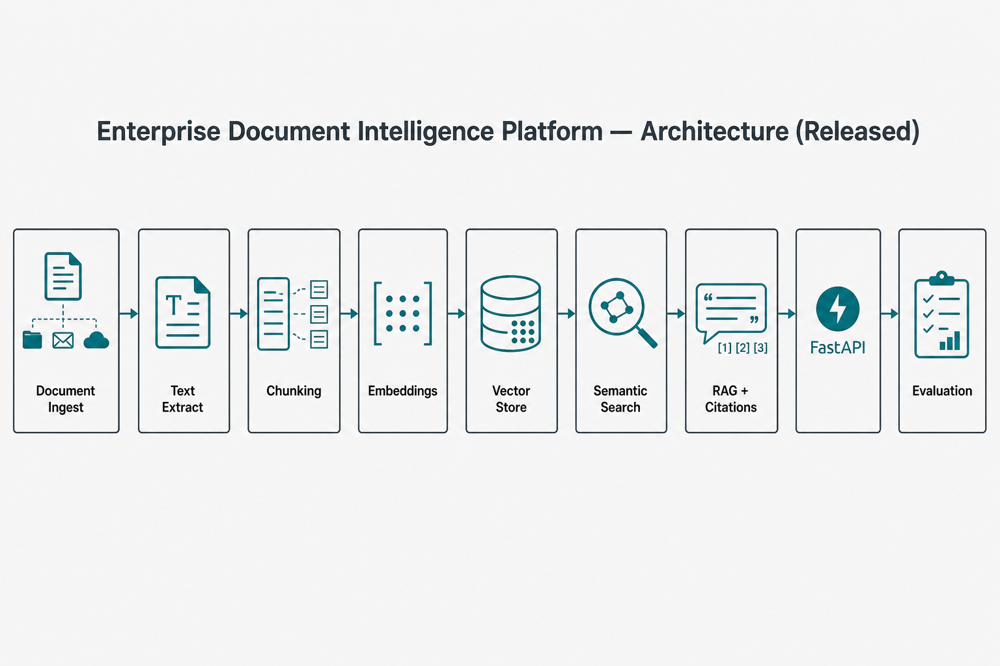

# Enterprise Document Intelligence Platform


**Mohammad Ahmadian — AI / Machine Learning Engineer**

Enterprise-Grade Intelligent Document Processing System powered by OCR, NLP and Large Language Models.

> Hiring managers: [Demo Website](presentation/demo-website/index.html) · [Dashboard](presentation/dashboard/index.html) · [Architecture](presentation/architecture/architecture.html) · [Presentation pack](presentation/README.md)

## Recruiter snapshot

| Item | Detail |
|------|--------|
| Domain | Intelligent Document Processing (IDP) |
| Capabilities | Ingest · extract · chunk · embed · semantic search · RAG with citations · field extraction |
| Target roles | Applied AI Engineer · LLM Engineer |
| Serving | FastAPI `/v1/ingest` · `/v1/search` · `/v1/ask` · `/v1/extract` |
| Integrity | Citations required · sample corpus · extractive default (optional LLM) |

### Evaluation (sample corpus)

| Metric | Value |
|--------|------:|
| Retrieval hit-rate @5 | **1.000** |
| Citation coverage | **1.000** |
| Faithfulness checklist | **1.000** |

Full report: [`reports/EVALUATION_REPORT.md`](reports/EVALUATION_REPORT.md)

## Architecture



*Figure 1. System architecture (Released).*

## Quick start

```bash
python -m venv .venv
.venv\Scripts\activate
pip install -r requirements.txt

set PYTHONPATH=src
python scripts/build_index_and_eval.py
uvicorn docintel.api.main:app --app-dir src --host 0.0.0.0 --port 8000
# http://localhost:8000/docs
```

### Example ask

```bash
curl -s -X POST http://localhost:8000/v1/ask ^
  -H "Content-Type: application/json" ^
  -d "{\"question\":\"What is the warranty period?\"}"
```

## Documentation

[`docs/00_MASTER_INDEX.md`](docs/00_MASTER_INDEX.md) · Status: [`docs/status.md`](docs/status.md)

Doc 13 is **Document Processing Pipeline** (IDP-specific; same numbering DNA as Project 1).

## Limitations (honest)

- Public/sample corpus — not a customer production archive  
- Default answers are **extractive** unless `LLM_API_KEY` is set  
- Local vector store for demo/CI; Postgres/pgvector path documented for enterprise Compose  

## Contact

mohammad.ahmadian.dev@gmail.com · [github.com/ahmadian-dev](https://github.com/ahmadian-dev) · Turkey (GMT+3)

## License

MIT — see [LICENSE](LICENSE).
